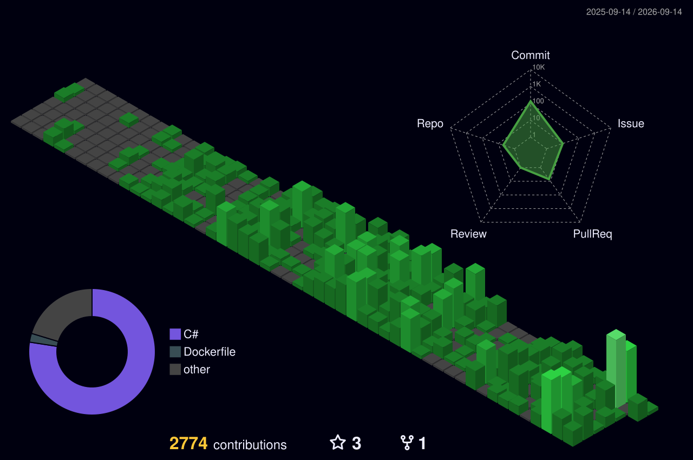

<div align="center">

```
 ██████╗██████╗ ██╗   ██╗ ██╗██████╗ ██████╗ ███████╗
██╔════╝██╔══██╗╚██╗ ██╔╝███║╚════██╗╚════██╗╚════██║
██║     ██████╔╝ ╚████╔╝ ╚██║ █████╔╝ █████╔╝    ██╔╝
██║     ██╔══██╗  ╚██╔╝   ██║ ╚═══██╗ ╚═══██╗   ██╔╝
╚██████╗██║  ██║   ██║    ██║██████╔╝██████╔╝   ██║
 ╚═════╝╚═╝  ╚═╝   ╚═╝    ╚═╝╚═════╝ ╚═════╝    ╚═╝
```

**`< building things that don't crash at 3am />`**

[](https://git.io/typing-svg)

</div>

---

## 👾 About

Hi 👋 My name is **cry1337**

```c#
namespace cry1337.About;
#pragma warning disable SMALL_STACK
public class cry1337
{
    public string[] Core     => ["C++", "C#", "ASP.Net Core", "Lua", "Docker", "Git"];
    public string[] Database => ["MySQL", "MongoDB", "SQLite", "PostgreSQL"];
    public string[] Editors  => ["Visual Studio Code", "Visual Studio", "Vim", "CLion", "Rider"];

    public string   Status   => "Currently writing code that future me will question";
    public string   Focus    => "Clean architecture & performant APIs";
    public bool     OpenToWork => true;
}
#pragma warning restore SMALL_STACK
```

---

## 🚀 Projects

<div align="center">

<table>
  <tr>
    <td width="50%">
      <h3 align="center">prod-26-individual</h3>
      <div align="center">
        <a href="https://github.com/cry-1337/prod-26-individual" target="_blank">
          
        </a>
        <br/><br/>
        <p>PROD 2026 contest task. Made it to the finals</p>
        <a href="https://prodcontest.com/" target="_blank">
          
        </a>
        <a href="https://github.com/cry-1337/prod-26-individual" target="_blank">
          
        </a>
      </div>
    </td>
    <td width="50%">
      <h3 align="center">cryme</h3>
      <div align="center">
        
        <br/><br/>
        <p><em>because managing customers can make you want to cry</em></p>
        <p>CRM system built from scratch</p>
        <a href="https://github.com/cry-1337/cryme" target="_blank">
          
        </a>
      </div>
    </td>
  </tr>
  <tr>
    <td width="50%" colspan="2">
      <h3 align="center">cGUI</h3>
      <div align="center">
        
        <br/><br/>
        <p>Engine-Agnostic GUI Library — separates GUI logic from the rendering backend. Use any renderer, keep the same UI code.</p>
        <a href="https://github.com/cry-1337/cGUI" target="_blank">
          
        </a>
      </div>
    </td>
  </tr>
</table>

</div>

---

## 🛠️ Tech Stack

<div align="center">

### Languages & Frameworks


### Databases


### Tools & DevOps


</div>

---

## 📊 GitHub Stats

<div align="center">
  
  
</div>

<div align="center">
  
</div>

---

## 📈 Activity Graph

<div align="center">
  
</div>

---

## 🐍 Contribution Snake

<div align="center">
  
</div>

---

## 🌌 3D Contribution Graph



---

## 💡 Random Dev Quote

<div align="center">

[](https://github.com/piyushsuthar/github-readme-quotes)

</div>

---

<div align="center">


**`// thanks for stopping by`**

</div>
